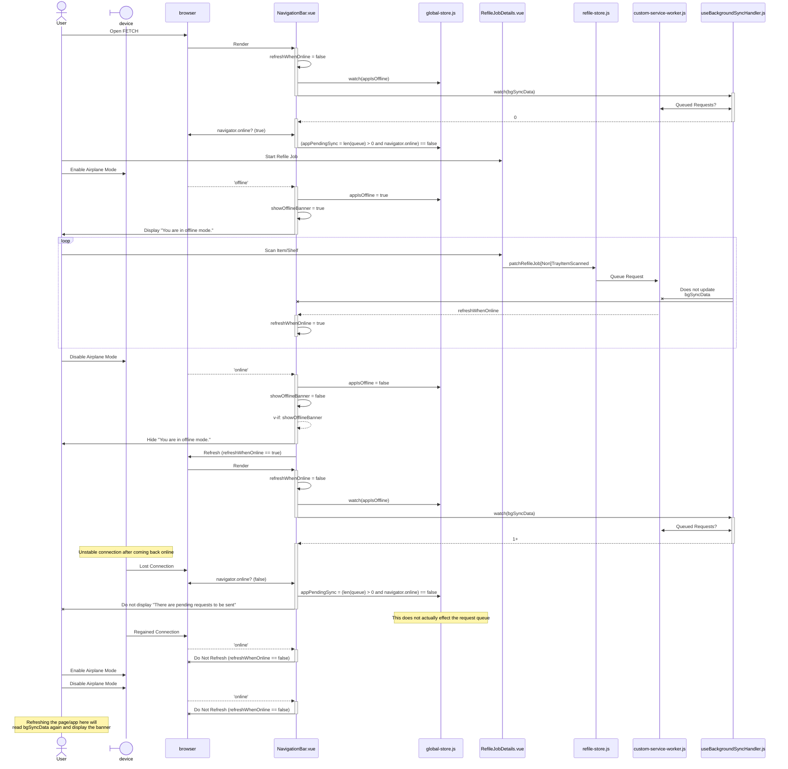

# Offline Refile

> Older sections of the repository do not have wifi, airplane mode gets activated
> The device shows refiling was succesful but syncing would fail back on wifi.
> This is catastrophic because that data is lost and the job has to be redone.
> This only happens with refile even though shelving also goes offline.

## Investigation

registerIndexDb is called whenever the useIndexDbHandler is used.
This relies upon an internal `indexDb` variable that doesn't appear to be saved anywhere?
An indexedDB is opened **without a version** and then `createObjectStore` is called for each of the stores (ownerTiers, shelving, picklist, refile).
It defaults to version 1 and so the 'global-data' will in theory be created only once.

After messing with Refile jobs offline the indexDb doesn't seem to have anything to do with the offline syncing.
It all comes down to workbox-background-sync.

I thought I made a breakthrough!
In MainLayout, every 8 hours the background worker is refreshed and the indexedDB databases are cleared.
This explicitly skips clearing out the request queue which I missed...

Digging deep into the lifecycle of the online/offline I was able to reproduce a "missing" sync banner.
Though, on page refresh the banner shows up again.
This workflow has been diagrammed below.

There are four places in the entire application that touch the indexedDb where requests are stored.
* register-service-worker and MainLayout delete databases that aren't named `workbox-background-sync`
* useIndexDbHandler.js deleteDataInIndexDb which is never called with a database named `workbox-background-sync`
* useBackgroundSyncHandler.js deleteDataInBackgroundSyncDb which is only called when a user clicks "Yes, Ignore Requests"
* Some unknown workbox-background-sync process

## Hypothesis and Possible Fixes

As far as I understand it I cannot reproduce the request queue completed being dropped, just having the banner not be displayed temporarily.
My hypothesis is that either
1. The edge case where the banner happens and the user re-performs the refile job without refreshing the page
1. The user does not read the pop-up modal and clicks "Yes, Ignore Requests" (not reading dialogs is very common)

Regardless of how we end up here there are ways to clean it up.

The application is "watching" the sync queue but this does not function.
When adding a new request to the queue watchers are not notified because it is not reactive.
I think there was a "fix" implemented to refresh the page when back online so the queue is read.

FETCH is not utilizing workbox-background-sync properly.
It is manually managing a background queue which is considered advanced usage.
Nothing about FETCH's offline mode is "advanced".

It is hard to disentangle the service worker's offline handling with FETCH's own.
FETCH stores data in localStorage to be used when offline.
It does not do a very good job of this, for example if you navigate to a Refile Job offline other than what you have saved you will get the wrong job information.

It is my opinion that FETCH should either
1. Use background sync as it was intended to be used and remove manual/visible sync processes
1. Do not use background sync and instead improve the offline storage implementation to enable "syncing" of stored state when online

Regardless of whether the service worker's background sync functionality is used the localStorage logic will need to be cleaned up.

### Diagram (of the banner not showing up)

