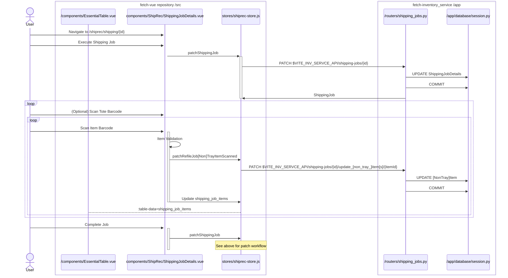

# Shipping Job

### Prerequisites

[NonTray]Items table will get a new column for tracking the shipping job.

### Diagram

This is very close to refiling, where there's a queue of items and the individually get updated as they're scanned.

