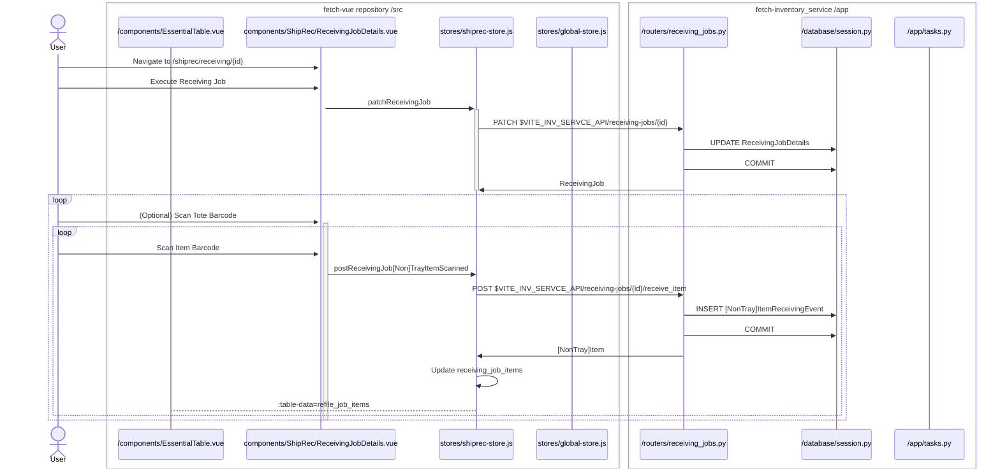

# Receiving Job

### Prerequisites

A new receiving_events table like the [non_tray_]items_retrieval_events table will have to be created.

A new background task to add the receiving jobs will have to be added.

### Diagram

This is closest to working an Accession job with an additional Tote piece.
The items already exist so the backend will know if they're trayed or non-trayed.

