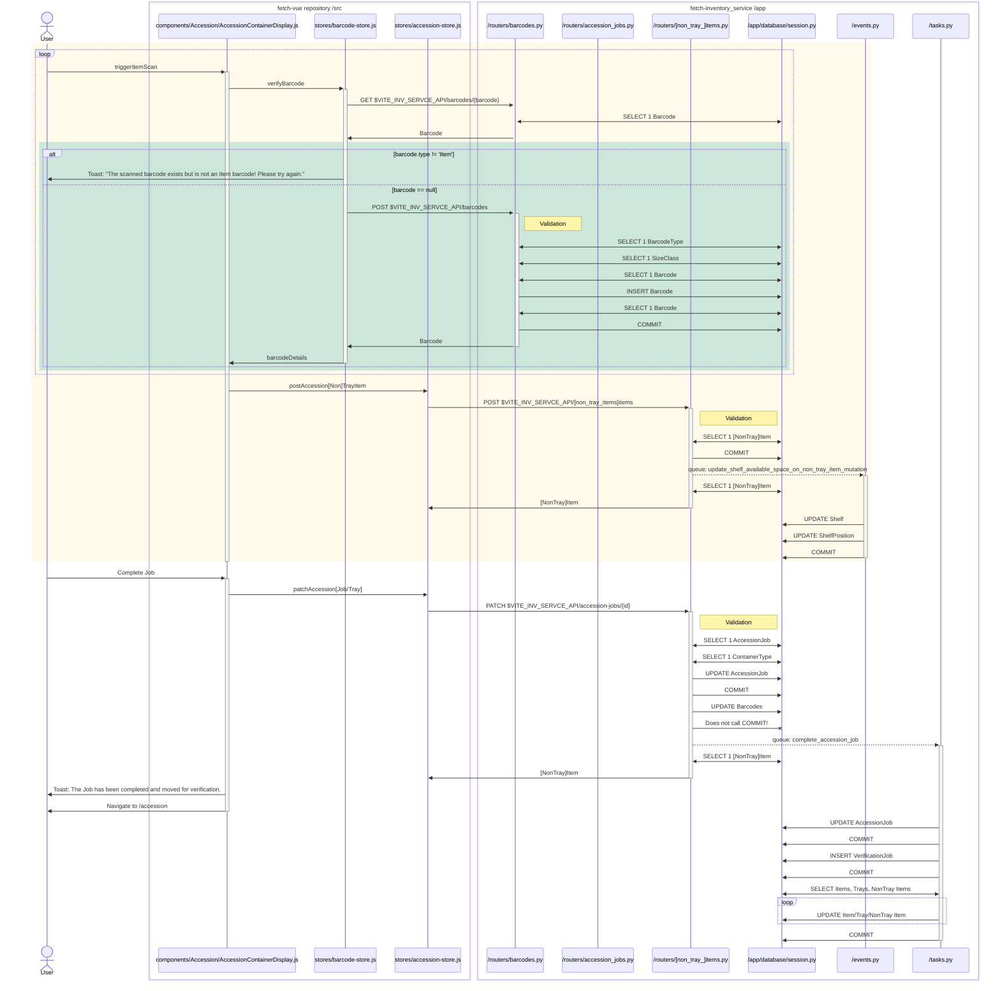

# Accession

#### The good

The patterns used here are consistent with elsewhere.

#### The ok but notable

AccessionDashboard and AccessionContainerDisplay are "components" instead of individual routes.
This leads to "Routing" happening both in vue-router and the Accession page itself.

Most of the calls to verifyBarcode are autoAdding the barcode.
Adding a barcode as part of the verifyBarcode method is somewhat surprising but has to be explicitly asked for.
The pattern of GET, check for 404, POST could be simplified to a PUT operation.

It's unclear to me why the barcode state is stored in a Pinia store.
I think this again relates back to not using Pinia properly.

Detecting duplication is done in python even though it is already enforced in the database.

Background tasks are hardcoded to run on the web server with no easy way to send them to background worker.

#### Areas of improvement

POSTing the AccessionJob returns the accession job.
Then all jobs are fetched after going back to the list page.
Then the current job is fetched after being selected in the list.
Then the current job is fetched again when navigating to the job page.
Using Pinia and Vue Router better can eliminate this redundant loading.

The AccessionTrayInfo and AccessionNonTrayInfo components are 85% the same.
There's about 500 lines of duplicated code.
There's already subtle formatting and logic differences between them which will grow over time.
Even without AccessionContainerDisplay there are branches for tray/non-tray that are 85% the same.
This duplication continues into the backend as well with the item and non_tray_item routes being 85% the same.

#### Red Flags

The server does not do enough to enforce data integrity
Some of it has been offloaded to the frontend but the design and implementation of the backend make it difficult.
This will make it harder to extend FETCH in the future.

An example is there is nothing server-side preventing an Accession Job from being completed multiple times.
Each time it is completed a new Verification Job is created.
Using the following snippet leads to multiple jobs being created.
```js
const complete = Array.from(document.getElementsByTagName('button')).filter(b => b.textContent === 'Complete')[0]
[complete, complete, complete, complete, complete].forEach(b => b.click());
```

Withdrawn barcode functionality does not work unless I'm misunderstanding it.
I withdrew a barcode then re-used it for a new Accession Job.
FETCH gave me the option to re-accession it but then immediately errors because it is a duplicate.

Completing an accession job is supposed to "unwithdraw" all the withdrawn barcodes but it is missing a database commit so it does not.

### Diagram

