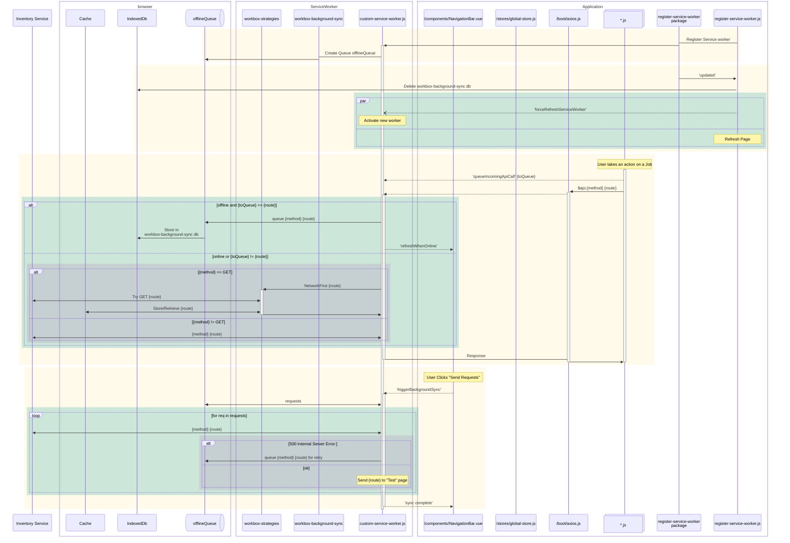

# Background Worker

#### The good

The documentation for making quasar pwa seems to have been followed.

#### The ok but notable

The quasar.conf.js specifies a lot of options for the pwa that are the same as the default.

Instead of using versioning for the indexedDBs the service worker deletes the database on upgrade.

Pre-caching doesn't seem to cache the whole site. (only icons??)
For example, if I've never visited the Accession Page I can't view it when offline.
This is an issue even after going back online until the pwa is refreshed.
Obviously the data can't be displayed but there is no indication to the user that the page can't be navigated to.
Once, I visit it the data and page are cached.

It is strange how the workbox-routing caching interacts with the data in indexedDB.
On some pages the data is entirely provided by the workbox-routing cache.
But refile and shelving both seem to implement their own indexedDB cache.

There's test code in the service workers that is shipped to production.

#### Areas of improvement

Navigating between refile jobs without internet doesn't load up the new job (obviously).
But it appears like it has and just displays the items from the previous job.
Turning back on internet after navigation completed the wrong job.

The register-service-worker package is an implicit dependency despite being used directly.

### Queueable Calls

* Pause/Resume shelving job
* Reassign (proposed) container location during shelving job
* Pause/Resume picklist job
* Return picklist item to queue
* Scanning a Item during picklist job
* Pause/Resume refile job
* Return refile item to queue
* Scanning a Item during refile job

### Diagram

