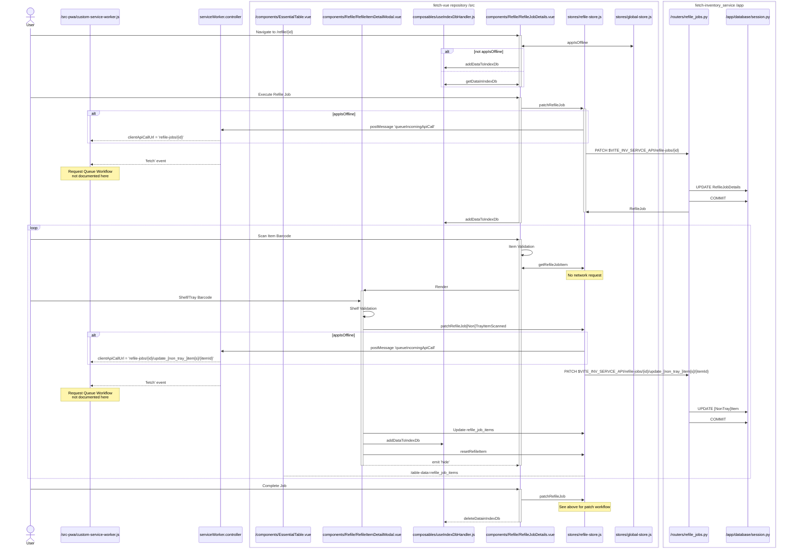

# Refile

#### The good

#### The ok but notable

It's weird that the caller to the IndexDB is doing the serialization.

The screen size is only checked on page load which means it doesn't show the appropriate table columns if the screen is resized.

The data saved in the indexeddb doesn't actually have anything to do with the offline sync functionality.

Interesting how the refile store is explicitly queuing network requests.

`manage_transition` isn't used for accession or verification jobs but looks to be used for shelving, picklist, and refile jobs.

This is the first instance I've seen of using a method on a store to run some js instead of make a network request.
getRefileJobItem just looks up items in the existing refileJob by barcode.

There's also inconsistency with Accession Jobs because there's no background tasks to complete it.

Again, the Tray/NonTray item codepaths are almost identical.

#### Areas of improvement

The data saved in the indexeddb for the refile job isn't saved per id.

Patching a job takes the client side run_timestamp. This allows manipulation of the start/end/transition time of jobs by an untrusted source.
There's also again not checking for referential integrity here. The API can refile any item in any state.
Additionally, the edit item endpoints really allows overposting and you can edit almost any value on the Item.

### Diagram

